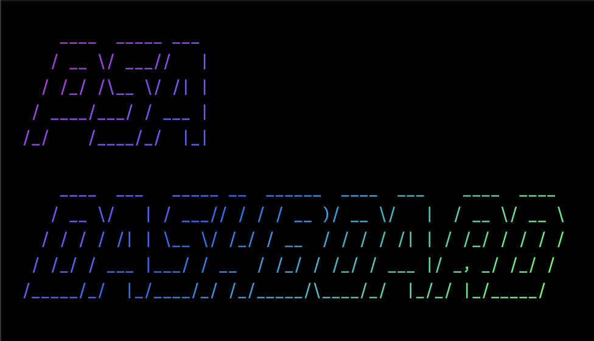

# PSA - Project State Agent

<p align="center">
  
</p>

**Manage your coding projects with AI-powered workflows**

For developers using Claude Code, Cursor, or other AI coding tools.

---

## 🚀 Quick Install (2 minutes)

```bash
# 1. Download PSA
git clone https://github.com/bradheitmann/psa.git ~/.psa

# 2. Run setup
cd ~/.psa && ./install.sh

# 3. Reload shell
source ~/.zshrc

# 4. Verify
psa help
```

**Done!** PSA is ready.

---

## ✨ What You Get

**In Claude Code, use these commands:**
- `/psa-tools-list` - Check your dev tools
- `/psa-tools-install` - Install missing tools
- `/psa-shortcuts` - Terminal productivity shortcuts

**In terminal:**
```bash
psa help              # Show all commands
psa init-project      # Create new project
psa update-self       # Update PSA from GitHub
psa dash              # Global project dashboard
psa sync-all-projects # Sync PSA updates to all projects
```

**New in v1.1.0:**
- `psa update-self` - Smart update system with customization preservation
- `psa sync-to-project` - Sync PSA to individual projects
- `psa sync-all-projects` - Batch sync to all tracked projects
- `/psa-help` - Comprehensive command reference in Claude Code
- `/psa-shortcuts` - 500+ line terminal shortcuts guide

---

## 📁 Your Projects

PSA creates: `~/dev_projects/` (customizable during setup)

All your projects in one place. Easy to find, easy to manage.

```bash
cd ~/dev_projects     # or: psa-projects
psa init-project my-app
```

---

## 🔧 Tool Management

**Check tools:**
```
/psa-tools-list
```

**Install missing:**
```
/psa-tools-install
```

**Update outdated:**
```
/psa-tools-update
```

Manages: git, node, python, ripgrep, fzf, and 20+ other tools via Homebrew.

---

## 📚 What PSA Does

1. **Tool Management** - Install/update development tools
2. **Project Organization** - All projects in one directory
3. **Agent Tracking** - Track AI agent performance (optional)
4. **MVC Protocol** - Follow best practices (optional)
5. **Bloat Management** - Keep projects clean

**Start simple.** Use what you need. Ignore the rest.

---

## 🆘 Help

**In Claude Code:**
```
/psa-status         # Show PSA status
/psa-shortcuts      # Terminal shortcuts
/psa-update         # Update PSA
```

**In terminal:**
```bash
psa help
```

**Documentation:** All commands are self-documenting. Just run them!

---

## 🔄 Updating PSA

```bash
psa update-self
```

Or in Claude Code:
```
/psa-update
```

**That's it!** PSA updates automatically from GitHub and syncs changes to all your projects.

**After updating, sync to your projects:**
```bash
psa sync-all-projects
```

See `docs/UPDATE-PROCEDURES.md` for full update workflows.

---

## 💡 Pro Tips

**Create project:**
```bash
psa init-project my-app
```

**Navigate to projects:**
```bash
psa-projects
```

**Check tool status:**
```
/psa-tools-list
```

**Power shortcuts:**
```
/psa-shortcuts
```

---

## 📖 Learn More

- **Tutorials:** `~/.psa/tutorials/`
- **Examples:** `~/.psa/examples/`
- **Protocols:** `~/.psa/protocols/`

**Or just start using it.** PSA teaches as you go.

---

## License

MIT © 2025

**Questions?** Open an issue on GitHub.
