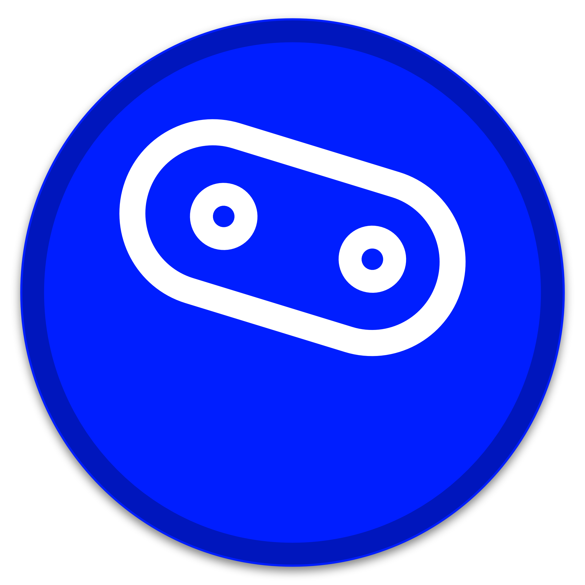

<p align="center">
  
</p>

<h1 align="center">PSA - Project State Agent</h1>

<h3 align="center">
  Beautiful terminal dashboard for managing any coding project
</h3>

<p align="center">
  Python • JavaScript • Rust • Go • Any Language<br/>
  <strong>With or without AI</strong> • Optional Claude Code integration
</p>

<p align="center">
  <a href="#quick-install">Quick Install</a> •
  <a href="#screenshots">Screenshots</a> •
  <a href="#features">Features</a> •
  <a href="#tutorials">Tutorials</a> •
  <a href="https://github.com/bradheitmann/psa/blob/main/docs/README-CLARIFICATION.md">Works with ANY Project</a>
</p>

<p align="center">
  
  
  
</p>

---

<br/>

> **For solo developers who maintain 5+ side projects simultaneously,** PSA creates a unified command center with visual progress tracking and one-keystroke navigation, **so you can context-switch between projects in seconds and know exactly where you left off** instead of spending 10 minutes every morning re-orienting yourself by running `cd`, `git status`, and `ls` across multiple directories.

<br/>

---

## 📸 Visual Experience

> **Note:** Code blocks below are monochrome (GitHub limitation). For COLORFUL screenshots with actual terminal colors (Catppuccin/Gruvbox/Tokyo Night palettes), run `demos/generate-screenshots.sh` or see [docs/GENERATE-COLORFUL-SCREENSHOTS.md](docs/GENERATE-COLORFUL-SCREENSHOTS.md).

### 1. Dashboard Overview - Executive View
```
╔══════════════════════════════════════════════════════════════════════════════╗
║                         PSA - PROJECT STATE AGENT                             ║
╠════════════════════════════════╤═════════════════════════════════════════════╣
║ KEY METRICS                    │ TREND ANALYSIS                              ║
║                                │                                             ║
║  Projects:   7    ↑2 this week │ Activity: ▂▄▅▆▇█▇▆▅▄ ↑ Positive           ║
║  Active:     5    71% portfolio│ Progress: ▄▅▆▇████ Strong Growth           ║
║  Total LOC:  67K  ↑8.2K added  │ Velocity: ▁▂▃▄▅▆▇███ Accelerating          ║
║  Coverage:   82%  ↑3% improved │                                             ║
╠════════════════════════════════╪═════════════════════════════════════════════╣
║ STATUS BREAKDOWN               │ TOP PROJECTS BY LOC                         ║
║                                │                                             ║
║ Active   ████████████████ 71%  │ company-api      ██████████████████ 22K    ║
║ Paused   ███░░░░░░░░░░░░  14%  │ mobile-app       ███████████░░░░░░ 15K     ║
║ Complete ███░░░░░░░░░░░░  14%  │ react-dashboard  █████████░░░░░░░░ 12K     ║
║                                │ flask-api        ██████░░░░░░░░░░░  8.5K    ║
╚════════════════════════════════╧═════════════════════════════════════════════╝
```
<p align="center"><em>Multi-panel executive dashboard with trend sparklines and status breakdown</em></p>

### Interactive Project List
```
╔══════════════════════════════════════════════════════════════════════╗
║                          SELECT PROJECT                               ║
╚══════════════════════════════════════════════════════════════════════╝

> flask-api        │ ● ACTIVE  │ 65%  │ 8.5K  │ web-app
  react-dashboard  │ ● ACTIVE  │ 80%  │ 12K   │ web-app
  rust-cli         │ ⏸ PAUSED  │ 40%  │ 3.2K  │ cli-tool
  mobile-app       │ ● ACTIVE  │ 50%  │ 15K   │ mobile
  company-api      │ ● ACTIVE  │ 90%  │ 22K   │ web-app

  5/7 ─────────────────────────────────────────────────────
> _
```
<p align="center"><em>Fuzzy search with fzf + live JSON preview</em></p>

### Project Detail View
```
╔══════════════════════════════════════════════════════════════════════╗
║                  flask-api - Flask REST API                           ║
╚══════════════════════════════════════════════════════════════════════╝

  ● ACTIVE

   Path:    ~/projects/flask-api
   GitHub:  https://github.com/user/flask-api
   Type:    web-app

  ━━━━━━━━━━━━━━━━━━━━━━━━━━━━━━━━━━━━━━━━━━━━━━━━━━━━━━━━━━━━━━━━━━

  PROGRESS

  Completion    ███████████████░░░░░  65%  ▲ +5% this week

  ━━━━━━━━━━━━━━━━━━━━━━━━━━━━━━━━━━━━━━━━━━━━━━━━━━━━━━━━━━━━━━━━━━

  METRICS

   Lines of Code:   8,500  ▲ +420 this week
   Test Coverage:   78%    ▼ -2%
   Git Commits:     234    ▲ +12 this week

  RECENT ACTIVITY: ▁▃▄▅▆█▇

  ACTIONS
  ➜ 1. Open in editor  ➜ 2. Browse files  ➜ 3. Git status
```
<p align="center"><em>Detailed metrics with trend indicators and quick actions</em></p>

### 2. Token Usage Analysis - Horizontal Bar Chart with Scale
```
Token Usage by Project (Claude Code)

[flask-api  ] ████████████████████████████████████████ 8.5M tokens (100%)
[react-dash ] ████████████████████                    5.2M tokens (61%)
[mobile-app ] ███████████████░░░░░░░░░░░░░░░░░░░░░░░░ 3.8M tokens (45%)
[rust-cli   ] ██████░░░░░░░░░░░░░░░░░░░░░░░░░░░░░░░░░ 2.1M tokens (25%)
[python-lib ] █████░░░░░░░░░░░░░░░░░░░░░░░░░░░░░░░░░░ 1.8M tokens (21%)
              |----------|----------|----------|----------|
              0         2M        4M        6M        8M

Total: 21.4M tokens  •  Average: 720 tokens/line  •  Est. Cost: $214
```
<p align="center"><em>Horizontal bar chart with precise scales and percentages</em></p>

### 3. Commit Activity Heatmap - GitHub-Style
```
Commit Activity Heatmap (Last 7 Days × 8 Time Blocks)

     00  03  06  09  12  15  18  21
    ┌───┬───┬───┬───┬───┬───┬───┬───┐
Mon │ · │ · │ ░ │ ▓ │ █ │ █ │ ▒ │ · │  Peak: 12-15h
Tue │ · │ · │ ▒ │ █ │ █ │ █ │ ▓ │ ░ │  Active all day
Wed │ · │ · │ ░ │ ▓ │ █ │ ▓ │ ▒ │ · │  Standard hours
Thu │ · │ · │ ▒ │ █ │ █ │ █ │ ▓ │ ░ │  High productivity
Fri │ · │ ░ │ ▒ │ ▓ │ █ │ ▒ │ ░ │ · │  Tapering off
Sat │ ░ │ ▒ │ ▓ │ ▒ │ ░ │ · │ · │ · │  Weekend coding
Sun │ ▒ │ ▓ │ ▒ │ ░ │ · │ · │ · │ · │  Light activity
    └───┴───┴───┴───┴───┴───┴───┴───┘

Legend: · None  ░ Low  ▒ Med  ▓ High  █ Peak
```
<p align="center"><em>Heatmap showing when you code most - optimize your schedule</em></p>

### 4. LOC Growth Over Time - Vertical Bar Chart
```
Lines of Code Growth (Last 6 Quarters)

22K ┤                                             █
20K ┤                                    █        █
18K ┤                           █        █        █
16K ┤                  █        █        █        █
14K ┤                  █        █        █        █
12K ┤         █        █        █        █        █
10K ┤         █        █        █        █        █
 8K ┤   █     █        █        █        █        █
 6K ┤   █     █        █        █        █        █
 4K ┤   █     █        █        █        █        █
 2K ┤   █     █        █        █        █        █
  0 └───┴─────┴────────┴────────┴────────┴────────┴
    Q3'23  Q4'23   Q1'24   Q2'24   Q3'24   Q4'24

Growth rate: +312% year-over-year  •  Velocity: ▲ Increasing
```
<p align="center"><em>Track codebase growth trends - see your productivity visualized</em></p>

### 5. Multi-Project Comparison - Grouped Stacked Bars
```
╔════════════════════════════════════════════════════════════════════════╗
║ PROJECT HEALTH COMPARISON                                              ║
║                                                                        ║
║ company-api    ████████████████████▓▓▓▓▓▓▓▓░░  Tests 85% | Coverage 90% ║
║ react-dash     ████████████████▓▓▓▓▓▓▓▓▓▓▓▓░░  Tests 75% | Coverage 80% ║
║ flask-api      ████████████▓▓▓▓▓▓▓▓░░░░░░░░░░  Tests 60% | Coverage 78% ║
║ mobile-app     ██████████████▓▓▓▓▓▓▓▓▓▓░░░░░░  Tests 70% | Coverage 72% ║
║ rust-cli       ██████████▓▓▓▓▓▓░░░░░░░░░░░░░░  Tests 50% | Coverage 68% ║
║                                                                        ║
║ Legend: ████ Passing Tests  ▓▓▓▓ Coverage Gap  ░░░░ Untested           ║
╚════════════════════════════════════════════════════════════════════════╝
```
<p align="center"><em>Stacked/grouped bars showing test coverage health across projects</em></p>

###  6. Development Velocity - Multi-Line Trend Chart
```
Progress Trends: LOC vs Tests vs Coverage (Last 9 Months)

100 ┤         *···*···*·····*                              LOC Growth
 90 ┤       *           o···o···o                          Test Count
 80 ┤     *         o···         o···o                     Coverage %
 70 ┤   *       o···                   +···+
 60 ┤ *     o···                     +       +
 50 ┤   o···                     +···           +···+
 40 ┤ o                     +···
 30 ┤                   +···
 20 ┤               +···
 10 ┤           +···
  0 └──────────────────────────────────────────
    Jan Feb Mar Apr May Jun Jul Aug Sep Oct Nov

Legend: * LOC (22K → 67K)  o Tests (120 → 580)  + Coverage (45% → 82%)
```
<p align="center"><em>Multi-line trend chart - see relationships between metrics over time</em></p>

### 7. Weekly Commit Sparklines - Inline Metrics
```
Project Health at a Glance

flask-api      Activity: ▁▃▄▅▇█▇▅▄▃ ↑  Coverage: ▂▄▆████ 78%  LOC: ████▇▇▆ 8.5K
react-dashboard Activity: ▃▃▄▄▅▅▆▆▇█ ↑  Coverage: ████████ 85%  LOC: ██████▇ 12K
mobile-app     Activity: ▁▁▁▂▃▄▅▆▇█ ↑  Coverage: ▃▃▄▄▅▅▆▆ 72%  LOC: ███████ 15K
rust-cli       Activity: ████▇▇▆▆▅▅ ↓  Coverage: ▂▃▄▅▆███ 68%  LOC: ██▇▆▅▄▃ 3.2K

┌─────────────────────────────────────────────────────────────────────┐
│ Quick Metrics:  CPU ▃▅▇█▇▅▃▁ 45%  •  Memory ▂▄▆████ 72%            │
│                 Active ▁▂▃▄▅▆▇█ ↑  •  Velocity ██▇▆▅▄ ↓ Slowing    │
└─────────────────────────────────────────────────────────────────────┘
```
<p align="center"><em>Sparklines show trends inline - see everything compactly</em></p>

### 8. Live System Monitor - Real-Time View
```
┌──────────────────────────────────────────────────────────────────────┐
│ PSA SYSTEM MONITOR                           ■ LIVE ■ 14:32:01       │
├──────────────────────────────────────────────────────────────────────┤
│                                                                      │
│ Active Projects    [████████████████░░░░] 71%  (5 of 7)             │
│ Avg Progress       [████████████████░░░░] 68%  ▲ +5% this week      │
│ Test Coverage      [████████████████░░░░] 82%  ▲ +3% this week      │
│ Token Budget       [██████░░░░░░░░░░░░░░] 24%  19.6M / 80M used     │
│                                                                      │
│ Active Sessions:   3 running  •  Last commit: 12 minutes ago        │
│ Sync Status: ✓ Up to date     •  Next scan: in 4 hours             │
│                                                                      │
│ Service Status:                                                      │
│ ✓ Git    ✓ Claude Code    ! Coverage (1 below 80%)    ✓ CI/CD       │
└──────────────────────────────────────────────────────────────────────┘
```
<p align="center"><em>Live system monitor - see status of everything in real-time</em></p>

### 9. Token Efficiency Scatter Plot - Find Outliers
```
Token Efficiency vs LOC (Each dot = 1 project)

10K ┤                               ●  company-api (efficient!)
 9K ┤                          ●    •  react-dash
 8K ┤                     •      ●     •  mobile-app
 7K ┤                 •      •          ○
 6K ┤            •     •         ○       python-lib
 5K ┤        •    •       ○  ○    ○
 4K ┤    •      •      ○        ○       rust-cli (needs opt!)
 3K ┤ •      ○      ○
 2K ┤     ○     ○
 1K ┤  ○     ○
  0 └─────────────────────────────────────────────
    0   200  400  600  800  1000  1200  1400
              Tokens per Line

● <500 T/L (Excellent)  • 500-800 T/L (Good)  ○ >800 T/L (Needs optimization)
```
<p align="center"><em>Scatter plot identifies inefficient projects - optimize AI usage</em></p>

### 10. Color Palette Showcase
```
🎨 PSA Color Schemes

Catppuccin Mocha  │  Gruvbox Dark  │  Tokyo Night
────────────────────────────────────────────────────
Lavender  ████    │  Orange  ████  │  Blue    ████
Mauve     ████    │  Yellow  ████  │  Cyan    ████
Sapphire  ████    │  Green   ████  │  Magenta ████
Sky       ████    │  Aqua    ████  │  Purple  ████
Teal      ████    │  Red     ████  │  Pink    ████
Green     ████    │  Purple  ████  │  Orange  ████

▁▂▃▄▅▆▇█  •  ░▒▓█  •  ·:!|  •  ○◔◑◐●  •  ─│┌┐└┘├┤┬┴┼═║╔╗╚╝╠╣╦╩╬
```
<p align="center"><em>Rich color palettes + diverse Unicode characters for any visualization</em></p>

---

## ⚡ Quick Install

```bash
# Homebrew (macOS/Linux)
brew tap bradheitmann/psa
brew install psa

# Manual install
git clone https://github.com/bradheitmann/psa.git
cd psa && ./install.sh

# Verify
psa version
```

**That's it!** Now run `psa` to see your dashboard.

---

## ✨ Features

<table>
<tr>
<td width="50%" valign="top">

### 🎨 **Visual Experience**
- Colorful ASCII visualizations
- Bar charts, sparklines, gauges
- Unicode box-drawing
- Nerd Font icons
- 3 color schemes (Gruvbox, Catppuccin, Tokyo Night)
- Progress bars with gradients

</td>
<td width="50%" valign="top">

### 🚀 **Works Everywhere**
- Any terminal (Warp, iTerm2, VS Code, SSH)
- macOS & Linux
- Works with ANY language/project
- No GUI required
- Fast, keyboard-driven
- Portable (XDG compliant)

</td>
</tr>
<tr>
<td width="50%" valign="top">

### 📊 **Core Metrics** (All Projects)
- Lines of code (LOC)
- Test coverage %
- File/module counts
- Git activity tracking
- Custom metrics support
- Progress percentages

</td>
<td width="50%" valign="top">

### 🤖 **AI Enhanced** (Optional)
- Token usage tracking
- Agent efficiency (tokens/line)
- Cost estimation
- PM review templates
- Dev handoff workflows
- Evidence bundles

</td>
</tr>
<tr>
<td width="50%" valign="top">

### 🔍 **Interactive**
- Fuzzy search (fzf)
- Live JSON previews
- File browsing (yazi)
- Git diffs (delta)
- Syntax highlighting (bat)
- Tab completion ready

</td>
<td width="50%" valign="top">

### 📁 **Multi-Project**
- Global overview dashboard
- Track unlimited projects
- Per-project metrics
- Cross-project analytics
- Auto-discovery
- Workspace support

</td>
</tr>
</table>

---

## 🎯 Use Cases

### For Solo Developers


Track personal projects with beautiful visualizations better than plain `git log`.

```bash
psa              # See all your projects
psa:init my-app  # Start tracking
psa list         # Quick overview
```

---

### For Team Leads


Manage multiple microservices/repos in one unified dashboard.

```bash
psa scan         # Discover all repos
psa              # Team overview
psa show api     # Check service status
```

---

### For AI-Assisted Development


Full token tracking, efficiency metrics, and cost estimation for Claude Code projects.

```bash
psa:analyze:tokens      # Token usage
psa:pm:review story-13  # PM workflows
psa:analyze:costs       # Cost breakdown
```

---

## 🚦 Quick Start

### 1. Initialize Your First Project

```bash
cd ~/projects/my-app
psa:init my-app
```

Creates `PROJECT.json` with metadata:
```json
{
  "name": "my-app",
  "status": "active",
  "progress": 0,
  "type": "web-app"
}
```

---

### 2. Scan Your Projects

```bash
psa scan
```

Discovers all projects in `~/projects` and `~/work`.

---

### 3. View Dashboard

```bash
psa
```

Beautiful, colorful overview of all your projects!

---

### 4. Explore Commands

```bash
psa help                # Full command list
psa list                # List all projects
psa show my-app         # Project details
psa:analyze:tokens      # AI metrics (if using Claude Code)
```

---

## 📚 Tutorials

**New to PSA?** Follow these step-by-step guides:

1. **[Getting Started](tutorials/01-GETTING-STARTED.md)** - Your first project (5 min)
2. **[Global Management](tutorials/02-GLOBAL-MANAGEMENT.md)** - Multi-project workflows (10 min)
3. **[Metrics & Tracking](tutorials/03-METRICS-TRACKING.md)** - Custom metrics (15 min)
4. **[Claude Code Integration](tutorials/04-CLAUDE-CODE.md)** - AI features (10 min)

---

## 🎨 Visual Library

PSA's colorful interface is powered by a custom visual library:

### Color Schemes
- **Gruvbox** - Warm, retro colors
- **Catppuccin** - Modern pastels
- **Tokyo Night** - Neon cyberpunk

### ASCII Art Elements
- ✅ Bar charts (horizontal & vertical)
- ✅ Sparklines (inline mini-charts)
- ✅ Progress bars with gradients
- ✅ Gauges (circular indicators)
- ✅ Unicode box-drawing
- ✅ Nerd Font icons (30+ icons)


---

## 🛠️ Configuration

PSA is highly customizable via `~/.psa/config.json`:

```json
{
  "version": "2.0.0",
  "projectDirs": [
    "~/projects",
    "~/work",
    "~/open-source"
  ],
  "dashboardTheme": "catppuccin",
  "toolsCheck": true,
  "updateCheckEnabled": true,
  "defaultEditor": "code",
  "excludeDirs": [
    "node_modules",
    ".git",
    "vendor",
    "dist"
  ]
}
```

**Edit:**
```bash
psa:config:edit
```

---

## 📦 Dependencies

### Required
- ✅ `jq` - JSON processing
- ✅ `git` - Version control

### Optional (Enhanced Experience)

| Tool | Purpose | Impact |
|------|---------|--------|
| `fzf` | Fuzzy search | ⭐⭐⭐⭐⭐ |
| `gum` | TUI components | ⭐⭐⭐⭐ |
| `bat` | Syntax highlighting | ⭐⭐⭐ |
| `delta` | Git diffs | ⭐⭐⭐ |
| `eza` | Modern ls | ⭐⭐⭐ |
| `yazi` | File manager | ⭐⭐⭐ |
| `figlet` | ASCII art | ⭐⭐ |
| `lolcat` | Rainbow colors | ⭐⭐ |
| `gnuplot` | Charts | ⭐⭐⭐ |

**Install all:**
```bash
brew install jq fzf gum bat git-delta eza yazi figlet lolcat gnuplot
```

---

## 🔥 Examples

### Example 1: Regular Python Project (No AI)

```bash
cd ~/projects/flask-api
psa:init flask-api

# Edit PROJECT.json
{
  "name": "flask-api",
  "status": "active",
  "progress": 60,
  "type": "web-app",
  "tech": {
    "languages": ["Python"],
    "frameworks": ["Flask"]
  }
}

psa show flask-api
```

**Result:** Beautiful dashboard showing LOC, git commits, progress.

---

### Example 2: Mixed Projects

```bash
~/projects/
  ├── ai-chatbot/      # Claude Code project → shows tokens
  ├── website/         # Regular HTML/CSS → shows basic metrics
  └── python-lib/      # Pure Python → shows coverage

psa scan  # Discovers all 3
psa       # Unified dashboard
```

**Result:** One dashboard for ALL projects, AI or not.

---

### Example 3: Team Microservices

```bash
~/work/
  ├── api-gateway/
  ├── auth-service/
  ├── payment-service/
  └── notification-service/

psa scan  # Discovers all services
psa list  # Quick health check
```

**Result:** Monitor all microservices at a glance.

---

## 🎬 Demo Videos

### Quick Tour (2 min)
[](demos/tour.gif)

### Features Deep Dive (5 min)
[](demos/features.gif)

### Claude Code Integration (3 min)
[](demos/claude-integration.gif)

---

## 🌟 Why PSA?

### ❌ Before PSA
```bash
# Jump between projects manually
cd ~/projects/app1 && git status
cd ~/projects/app2 && git status
cd ~/projects/app3 && git status

# Count LOC with wc
find . -name "*.py" | xargs wc -l

# Check test coverage
pytest --cov

# Track progress... in your head?
```

### ✅ With PSA
```bash
psa

# Output:
# ╔═══════════════════════════════════╗
# ║  3 ACTIVE PROJECTS                ║
# ║  ██████████████░░░░░░  65% avg    ║
# ║  25K total LOC                    ║
# ║  82% average coverage             ║
# ╚═══════════════════════════════════╝
```

**One command. Beautiful visualization. All projects.**

---

## 🤝 Contributing

Contributions are welcome!

1. Fork the repository
2. Create a feature branch (`git checkout -b feature/amazing`)
3. Commit changes (`git commit -m 'Add amazing feature'`)
4. Push to branch (`git push origin feature/amazing`)
5. Open a Pull Request

See [CONTRIBUTING.md](CONTRIBUTING.md) for guidelines.

---

## 📄 License

MIT License - see [LICENSE](LICENSE)

Free to use, modify, and distribute.

---

## 🙏 Acknowledgments

**Built with:**
- [Charm](https://charm.sh/) tools (gum, glow, vhs)
- [fzf](https://github.com/junegunn/fzf) - Fuzzy finder
- [jq](https://stedolan.github.io/jq/) - JSON processor
- Inspired by: `starship`, `bat`, `eza`, `btop`

**Special thanks to:**
- Claude Code for AI-assisted development
- Terminal enthusiasts worldwide
- Open source community

---

## 📞 Support

- **Documentation:** [docs/](docs/)
- **Issues:** [GitHub Issues](https://github.com/bradheitmann/psa/issues)
- **Discussions:** [GitHub Discussions](https://github.com/bradheitmann/psa/discussions)

---

<p align="center">
  <strong>Made with ❤️ for developers who love the command line</strong>
</p>

<p align="center">
  <a href="#quick-install">Get Started</a> •
  <a href="tutorials/01-GETTING-STARTED.md">Tutorial</a> •
  <a href="https://github.com/bradheitmann/psa">Star on GitHub ⭐</a>
</p>
